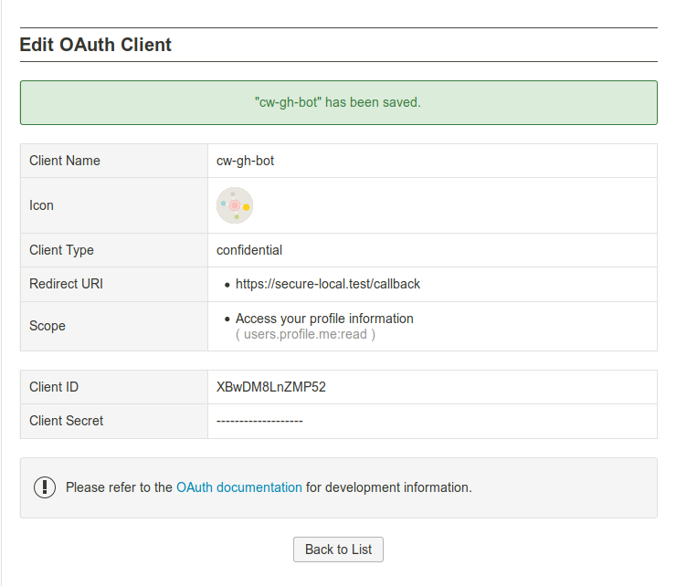

## Getting started

### 1. OAuth2 client registration

[client registration- ChatWork](https://www.chatwork.com/service/packages/chatwork/subpackages/oauth/client_create.php)




```bash
$ cp .env.example .env
```

Edit `OAUTH2_CLIENT_ID`, `OAUTH2_CLIENT_SECRET`, `OAUTH2_REDIRECT_URI`.
```bash
$ vi .env
```

### 2. Enable SSL & generate a self-signed cert

Download [mkcert](https://github.com/FiloSottile/mkcert/releases)

Example using Ubuntu 64bit:

```bash
wget -O mkcert https://github.com/FiloSottile/mkcert/releases/download/v1.3.0/mkcert-v1.3.0-linux-amd64
chmod +X mkcert
sudo mv mkcert /usr/local/bin
```

Generate certificate:

```bash
sudo apt install libnss3-tools
mkcert -install
mkcert secure-local.test
mkdir ~/.ssl
mv secure-local.test* ~/.ssl
realpath ~/.ssl/secure-local.test # to get absolute path /home/ubuntu/.ssl/secure-local.test
```

### 3. Start servers

```bash
php artisan serve --port=8019
```

### 4. Update hosts file

```bash
$ echo '127.0.0.1 secure-local.test' | sudo tee -a /etc/hosts
```

### 5. Setup apache2 reverse proxy

`sudo vi /etc/apache2/sites-available/secure-local.test.conf`

```apache
<VirtualHost *:443>
    SSLEngine On
    ProxyPreserveHost On
    ProxyRequests Off
    ServerName secure-local.test

    # Set the path to SSL certificate
    # Usage: SSLCertificateFile /path/to/cert.pem
    SSLCertificateFile /home/ubuntu/.ssl/secure-local.test.pem
    SSLCertificateKeyFile /home/ubuntu/.ssl/secure-local.test-key.pem

    # Servers to proxy the connection, or;
    # List of application servers:
    # Usage:
    # ProxyPass / http://[IP Addr.]:[port]/
    # ProxyPassReverse / http://[IP Addr.]:[port]/
    # Example:
    ProxyPass / http://localhost:8019/
    ProxyPassReverse / http://localhost:8019/
    RequestHeader set X-Forwarded-Proto "https"
</VirtualHost>
```

Enable apache module, site:
```
sudo a2enmod proxy_http ssl headers
sudo a2ensite secure-local.test.conf

```

Access https://secure-local.test via browser

## Sample code

### Generate a consent page link

https://github.com/ada-u/chatwork-oauth2-client-example/blob/master/app/Http/Controllers/WelcomeController.php


### Obtain an access token and refresh a token 

https://github.com/ada-u/chatwork-oauth2-client-example/blob/master/app/Http/Controllers/CallbackController.php


## License

[MIT license](http://opensource.org/licenses/MIT).
